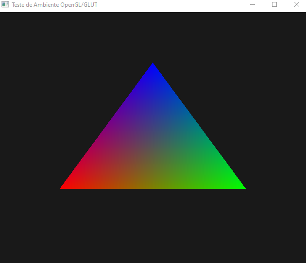

<h1 align="center">C + OpenGL com FreeGLUT</h1>

<p align="center">
  Starter kit rapido para criar projetos graficos em C com FreeGLUT no Windows.
</p>

<p align="center">
  
  
  
  
</p>

## Sobre o projeto

Este repositorio e uma base enxuta para quem quer comecar rapido com **C + OpenGL + FreeGLUT**.

A ideia e simples: abrir o projeto, compilar e ja ter uma janela grafica rodando, sem perder tempo com setup inicial.

## Preview



## Destaques

- Estrutura minima e limpa para projetos graficos em C.
- `Makefile` pronto para compilar e executar.
- `freeglut.dll` copiada automaticamente para `build/`.
- Dependencias do FreeGLUT ja versionadas em `include/`, `lib/` e `bin/`.

## Stack

- C
- OpenGL (legacy pipeline)
- FreeGLUT
- GCC (MinGW-w64)
- Make (mingw32-make)

## VS Code (configuracao embutida)

Este projeto ja inclui configuracao pronta em `.vscode/` para acelerar o fluxo de desenvolvimento:

- `tasks.json`: build padrao com `mingw32-make` e task de limpeza.
- `launch.json`: execucao/debug com `gdb` em `build/app.exe`, usando pre-build automatico.
- `settings.json`: formatter C/C++ predefinido via `ms-vscode.cpptools`.

Com isso, voce pode abrir o projeto no VS Code e usar:

- `Ctrl+Shift+B` para compilar.
- `F5` para rodar/debug.

## Como rodar localmente

### 1. Pre-requisitos

Obrigatorios:

- Windows 10/11
- GCC (MinGW-w64) com `gcc` no `PATH`
- Make (`mingw32-make`) no `PATH`

Recomendados para experiencia completa:

- VS Code
- Extensao C/C++ da Microsoft (`ms-vscode.cpptools`)
- GDB instalado (ex.: `C:/msys64/ucrt64/bin/gdb.exe`)

Validacao rapida do ambiente:

```powershell
gcc --version
mingw32-make --version
gdb --version
```

### 2. Compilar

```powershell
mingw32-make
```

Arquivos gerados:

- `build/app.exe`
- `build/freeglut.dll`

### 3. Executar

```powershell
mingw32-make run
```

### 4. Limpar build

```powershell
mingw32-make clean
```

## Estrutura

```text
.
|-- src/        # Codigo-fonte
|-- include/    # Headers do FreeGLUT
|-- lib/        # Bibliotecas para link
|-- bin/        # DLLs para runtime
|-- build/      # Saida da compilacao
|-- Makefile
```

## Personalizacao rapida

- Edite `src/main.c` para iniciar seu experimento grafico.
- Ajuste `CFLAGS` no `Makefile` para debug/otimizacao.
- Adicione novos `.c` em `src/` (coleta automatica pelo `wildcard`).

## Licenca

Distribuido sob licenca MIT. Consulte `LICENSE`.
